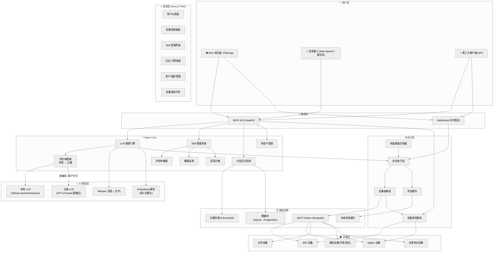

# Home Steward Agent — 系统架构总览

> 版本: v0.1 | 最后更新: 2025-06-09

---

## 一、分层架构总图



---

## 二、核心架构分层

```
┌─────────────────────────────────────────────────────────────────────────────┐
│                                                                             │
│                              📱 表现层                                       │
│                  Next.js PWA (Web + 移动端浏览器)                            │
│    仪表盘 · 设备控制 · Skill管理 · 记忆查看 · 用户管理 · 设备发现向导       │
│              REST + WebSocket  ←→  Agent Core                               │
│                                                                             │
├─────────────────────────────────────────────────────────────────────────────┤
│                                                                             │
│                              🧠 Agent Core                                   │
│                                                                             │
│  ┌──────────────────────────────────────────────────────────────────────┐   │
│  │                     LLM 推理引擎                                       │   │
│  │  ┌─────────────┐  ┌──────────────┐  ┌────────────┐  ┌──────────┐   │   │
│  │  │ 快速通道     │  │ 标准通道     │  │ 深度通道   │  │ 混合调度器│   │   │
│  │  │ (规则匹配)   │  │ (本地小模型)  │  │(大模型/云端)│  │(隐私分界) │   │   │
│  │  └─────────────┘  └──────────────┘  └────────────┘  └──────────┘   │   │
│  └──────────────────────────────────────────────────────────────────────┘   │
│                                                                             │
│  ┌──────────────────────────────────────────────────────────────────────┐   │
│  │                     Skill 管理系统                                     │   │
│  │  ┌──────────┐ ┌──────────┐ ┌──────────┐ ┌──────────┐ ┌──────────┐   │   │
│  │  │ 运行时    │ │ 仓库     │ │ 冲突仲裁器 │ │ 健康监测  │ │ 回滚沙箱  │   │   │
│  │  │ (执行)    │ │ (存储)   │ │ (防冲突)  │ │ (保健康)  │ │ (安全回滚)│   │   │
│  │  └──────────┘ └──────────┘ └──────────┘ └──────────┘ └──────────┘   │   │
│  └──────────────────────────────────────────────────────────────────────┘   │
│                                                                             │
│  ┌──────────────────────────────────────────────────────────────────────┐   │
│  │                    分层记忆系统                                         │   │
│  │  ┌──────────────┐  ┌──────────────┐  ┌──────────────┐                  │   │
│  │  │ 短期记忆      │  │ 中期记忆      │  │ 长期记忆      │                  │   │
│  │  │ (当前会话)    │  │ (周级摘要)    │  │ (用户画像)    │                  │   │
│  │  └──────────────┘  └──────────────┘  └──────────────┘                  │   │
│  │  冷启动加速器 · 种子记忆 · 向量检索 · 自动过期                          │   │
│  └──────────────────────────────────────────────────────────────────────┘   │
│                                                                             │
│  ┌──────────────────────────────────────────────────────────────────────┐   │
│  │                    多用户管理                                           │   │
│  │  用户画像 · 声纹识别 (本地) · 权限等级 · 偏好隔离 · 冲突解决建议        │   │
│  └──────────────────────────────────────────────────────────────────────┘   │
│                                                                             │
├─────────────────────────────────────────────────────────────────────────────┤
│                                                                             │
│                              ⚙️ 执行层                                       │
│                                                                             │
│  ┌──────────────────────────────────────────────────────────────────────┐   │
│  │  安全执行层                                                           │   │
│  │  ● 意图白名单校验  ● 指令参数范围验证  ● 速率限制                      │   │
│  │  ● 异常熔断        ● 完整操作审计日志  ● 紧急通道绕过                  │   │
│  └──────────────────────────────────────────────────────────────────────┘   │
│                                                                             │
│  ┌──────────────────────────────────────────────────────────────────────┐   │
│  │  设备抽象层                                                           │   │
│  │  统一设备模型 · MQTT 驱动 · 直连降级 · 状态缓存 · 设备发现             │   │
│  └──────────────────────────────────────────────────────────────────────┘   │
│                                                                             │
├─────────────────────────────────────────────────────────────────────────────┤
│                                                                             │
│                           🗄️ 基础设施                                        │
│    MQTT Broker     SQLite→PostgreSQL     ChromaDB 向量库    本地缓存         │
│    (设备通信枢纽)    (结构化数据)          (语义检索)         (断连保护)     │
│                                                                             │
└─────────────────────────────────────────────────────────────────────────────┘
```

---

## 三、请求响应路径（三种场景）

### 场景 A：简单指令 — 快速通道

```
"开灯"
  │
  ├─► Web UI → POST /api/devices/command
  │
  ├─► ExpressMatcher 匹配成功 ({intent: "turn_on", device: "light"})
  │    ● 纯正则匹配，零 LLM 调用
  │    ● 耗时: < 50ms
  │
  ├─► 安全执行层校验 → 通过
  │
  ├─► 设备抽象层 → MQTT 指令 → 灯亮
  │
  └─► 响应返回 → 灯的状态更新推送到 UI
```

### 场景 B：模糊意图 — 标准通道

```
"把客厅弄得温馨一点"
  │
  ├─► ExpressMatcher 匹配失败 → 转标准通道
  │
  ├─► 本地小模型 (Qwen2.5-3B) 解析意图
  │    ● 耗时: ~2-5 秒
  │    ● 输出: {domain: "scene", scene: "cozy", room: "living"}
  │
  ├─► 冲突仲裁器检查 → 无冲突 skill
  │
  ├─► 安全执行层 → 分解为 3 条子指令
  │    ├─ light_strip → 色温 2700K, 亮度 60%
  │    ├─ ac → 温度 24°C, 制冷模式
  │    └─ curtain → 开合度 50%
  │
  ├─► MQTT → 设备执行
  │
  └─► 记忆系统记录 → "用户喜欢温馨场景 (living, 22:00)"
```

### 场景 C：进化 — Agent 自写 Skill

```
"帮我写个skill，每天7点自动开咖啡机"
  │
  ├─► LLM 评估 → 需要创建新 skill
  │
  ├─► 调用 /writing-skills 流程
  │    ├─ 分析需求 → 生成 SKILL.md
  │    ├─ 生成代码 (Python)
  │    └─ 生成测试用例
  │
  ├─► 沙箱验证 → 运行测试 → 全部通过
  │
  ├─► 通知用户审批
  │    └─ 用户批准
  │
  ├─► 灰度部署 → 只读 48h → 异常率 0%
  │
  ├─► 正式部署 → Skill 入库
  │
  └─► 健康监测 → 每周自动检查
```

---

## 四、模块依赖关系

```
                     ┌─────────────┐
                     │   Web UI    │
                     └──────┬──────┘
                            │ REST + WS
                     ┌──────▼──────┐
                     │   API 网关   │
                     └──────┬──────┘
                            │
         ┌──────────────────┼──────────────────┐
         │                  │                  │
  ┌──────▼──────┐  ┌───────▼───────┐  ┌───────▼──────┐
  │ LLM 推理引擎  │  │ Skill 管理系统 │  │  记忆系统     │
  │              │  │              │  │              │
  │ 依赖:        │  │ 依赖:        │  │ 依赖:        │
  │  • 本地模型   │  │  • LLM(写skill)│  │  • ChromaDB  │
  │  • 云端API   │  │  • 文件系统    │  │  • SQLite    │
  │  • Embedding  │  │  • Git       │  │  • 时间调度   │
  └──────┬──────┘  └──────┬───────┘  └──────┬───────┘
         │                │                  │
         └────────────────┼──────────────────┘
                          │
                   ┌──────▼──────┐
                   │  安全执行层   │
                   │              │
                   │ 依赖: 无     │ ← 核心：不依赖任何上层
                   └──────┬──────┘     LLM 挂了也能执行
                          │
                   ┌──────▼──────┐
                   │  设备抽象层   │
                   │              │
                   │ 依赖: MQTT  │ ← MQTT 可降级
                   └──────┬──────┘
                          │
                   ┌──────▼──────┐
                   │    设备      │
                   └─────────────┘
```

### 依赖约束

| 模块 | 启动必须 | 可选依赖 | 故障影响 |
|------|---------|---------|---------|
| 安全执行层 | 无 | 无 | 系统不可用 (核心) |
| 设备抽象层 | MQTT | 状态缓存 | 设备不可控，降级 |
| 快速通道匹配器 | 无 | 无 | 简单指令变慢 |
| LLM 推理引擎 | 无 | 本地模型/云端API | 模糊指令降级为"不理解"，简单指令不受影响 |
| Skill 管理系统 | 无 | LLM、Git | 新 skill 无法创建，已有 skill 继续运行 |
| 记忆系统 | SQLite | ChromaDB | 失去记忆功能，核心指令不受影响 |
| 多用户管理 | 无 | 声纹模型 | 回退到单用户模式 |
| Web UI | API 网关 | 无 | 无界面 |

---

## 五、数据存储设计

```
┌──────────────────────────────────────────────────────────────────┐
│                        数据库分布                                   │
│                                                                    │
│  SQLite (主数据库)                                                  │
│  ├── users         用户账号 + 角色                                  │
│  ├── devices       设备注册表 (ID, 名称, 类型, MQTT topics)         │
│  ├── device_states 设备状态缓存 (最后一次已知状态)                   │
│  ├── commands      操作审计日志 (谁/什么时间/做了什么)               │
│  ├── skills        Skill 注册表 (名称, 版本, 元数据)                │
│  ├── skill_versions Skill 版本历史                                  │
│  ├── conflicts     冲突记录                                         │
│  ├── user_preferences 用户偏好                                      │
│  └── memories       长期记忆 (结构化摘要)                           │
│                                                                    │
│  ChromaDB (向量数据库)                                               │
│  ├── memory_embeddings  记忆向量索引 (用于语义检索)                  │
│  └── user_voiceprints   用户声纹向量 (本地, 不传出)                  │
│                                                                    │
│  文件系统                                                           │
│  ├── skills/<name>/     Skill 代码 + 测试用例 (Git 仓库)            │
│  ├── logs/              系统日志                                    │
│  └── config/            配置文件                                    │
└──────────────────────────────────────────────────────────────────┘
```

---

## 六、关键设计决策

| 决策 | 选择 | 替代方案 | 理由 |
|------|------|---------|------|
| **后端语言** | Python (FastAPI) | TypeScript / Go | AI 生态独占、MQTT/硬件库最成熟 |
| **设备通信** | MQTT (发布/订阅) | HTTP / gRPC | 设备控制事实标准，天然解耦 |
| **Web 框架** | Next.js + PWA | React Native / Flutter | 一套代码覆盖 Web+移动端 |
| **LLM 策略** | 三级通道 | 全走 LLM / 全规则 | 兼具速度(简单指令)和智能(复杂需求) |
| **Skill 格式** | Python 代码 + manifest | DSL / 配置驱动 | Python 最灵活，LLM 生成最自然 |
| **记忆存储** | SQLite + ChromaDB | 纯向量库 / 纯关系库 | 兼顾结构化查询和语义检索 |
| **冷启动策略** | 种子记忆 + 观察加速 | 纯学习 / 纯配置 | 平衡"开箱可用"和"个性化" |
| **多用户识别** | 声纹 + 登录态 | 人脸 / 蓝牙 | 隐私友好(本地提取)+实现简单 |
| **云端调用** | 脱敏 + 用户许可 + 可配置 | 全本地 / 全云端 | 隐私安全 + 必要时获得更好能力 |
| **部署方式** | Docker Compose | Kubernetes / 裸机 | 单机场景足够，复杂度最低 |

---

## 七、技能 (Skill) 系统结构

```
一个 Skill = 一个自包含的能力单元

my-skill/
├── SKILL.md              # 元数据声明 (名称、版本、域、优先级)
├── main.py               # 实现代码
├── tests/                # 测试用例 (健康监测会定期运行)
│   └── test_main.py
├── schemas/              # 数据格式定义 (用于回滚兼容性检查)
│   ├── v1.json
│   └── v2.json
└── requirements.txt      # 依赖 (可选)
```

**Skill 生命周期:**
```
草稿 ──→ 沙箱测试 ──→ 用户审批 ──→ 灰度部署 ──→ 生产
  ↑                        │                        │
  └── 退回修改 ────────────┘                        │
                                                    ↓
                                              健康监测 ←──→ 自动修复
                                                    │
                                              异常发现 → 自动停用 → 通知用户
```

---

## 八、安全边界

```
                     ┌────────────────────────┐
                     │    用户 (最终决策者)      │
                     │  ● 审批新 skill         │
                     │  ● 批准云端调用         │
                     │  ● 调整优先级           │
                     │  ● 查看审计日志         │
                     └──────────┬─────────────┘
                                │
                     ┌──────────▼─────────────┐
                     │     LLM (建议层)         │
                     │  ● 理解意图             │
                     │  ● 提出方案             │
                     │  ● 生成 skill 草案      │
                     │  ✗ 不能直接控制设备     │
                     │  ✗ 不能直接部署代码     │
                     └──────────┬─────────────┘
                                │ 结构化意图 (非原始输出)
                     ┌──────────▼─────────────┐
                     │     安全执行层            │
                     │  ● 白名单校验            │
                     │  ● 参数范围验证          │
                     │  ● 速率限制              │
                     │  ● 操作审计              │
                     └──────────┬─────────────┘
                                │ 通过校验的命令
                     ┌──────────▼─────────────┐
                     │       设备               │
                     └────────────────────────┘
```

---

## 九、部署拓扑 (MVP)

```
┌─────────────────────────────────────────────────────┐
│                  一台机器 (NUC / 旧PC / 服务器)        │
│                                                     │
│  ┌────────┐  ┌────────┐  ┌────────┐  ┌──────────┐  │
│  │ FastAPI│  │ Next.js│  │ MQTT   │  │ Local LLM│  │
│  │ 后端    │◄─┤ 前端    │  │ Broker │  │ (Ollama) │  │
│  │ :8000  │  │ :3000  │  │ :1883  │  │ :11434   │  │
│  └────┬───┘  └────────┘  └────┬───┘  └──────────┘  │
│       │                       │                      │
│  ┌────▼───┐          ┌───────▼────┐                 │
│  │ SQLite │          │ 外部设备    │                 │
│  │ +Chroma│          │ (WiFi/etc) │                 │
│  └────────┘          └────────────┘                 │
│                                                     │
│  Docker Compose 一键部署                              │
└─────────────────────────────────────────────────────┘
```
